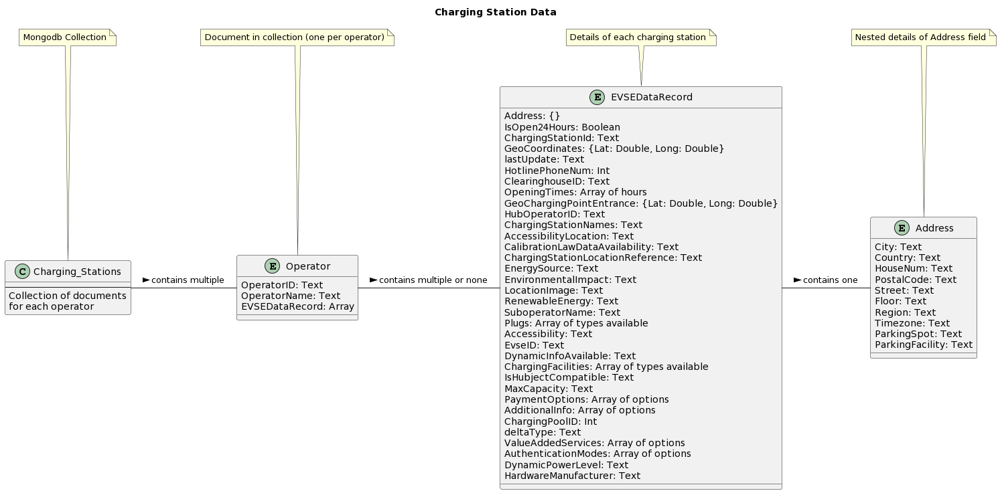

# MongoDB - BigDataLab HSLU
In the course BigDataLab @HSLU, each student have developed a project to analyze the data using [MongoDB](https://www.mongodb.com/) database.  

This repository contains the code for my project. The focus of this repository is to deepen the knowledge of MongoDB and to learn how to use it. 
The used API are from [National Data Infrastructure For Electromobility](https://opendata.swiss/de/dataset/ladestationen-fuer-elektroautos/resource/e33957be-180a-422b-90a5-fbfe9774927a) and [Swisspost](https://swisspost.opendatasoft.com/explore/dataset/plz_verzeichnis_v2/information/?disjunctive.postleitzahl).  

Briefly describing the structure of infrastructure data:

The db is hosted on [MongoDB Atlas](https://www.mongodb.com/cloud/atlas/).  

